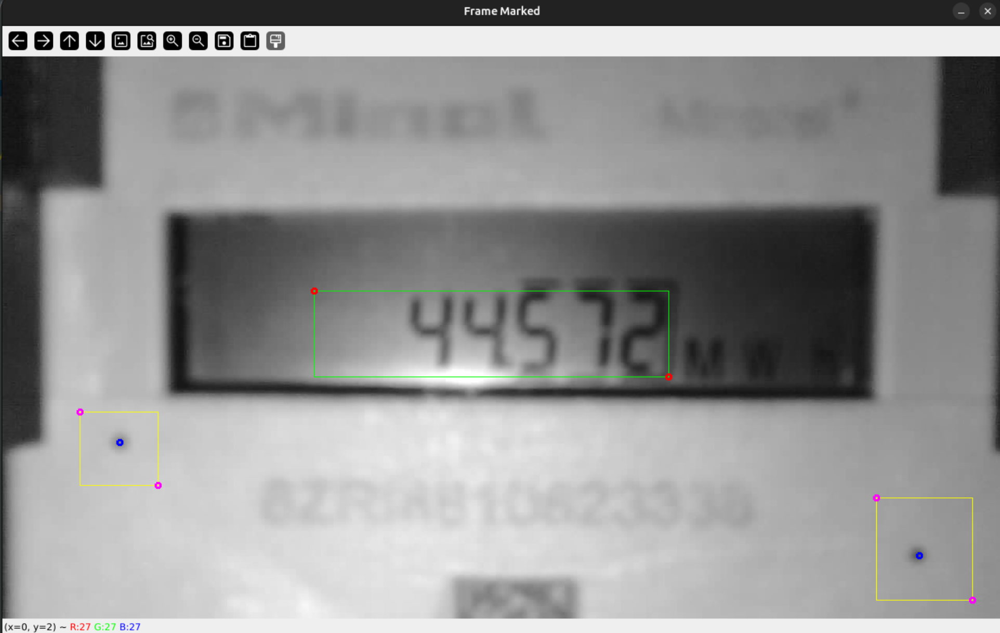

# Minol Reader

Buildings using district heating often have a heat meter to measure the amount of heat used by the building. The Minol heat meter is a common heat meter used in Germany. It usually can display the current heat usage value on a seven segment display. In order to digitally capture the current reading of the Minol meter a custom system has been implemented: the Minol Reader.
 
The reading is then sent via MQTT to a Home Assistant instance. (Although with some modification the number without the use of MQTT or Home Assistant can be extracted)

The Minol Reader consists of:
- ESP Cam (ESP32-CAM) mounted onto the Minol meter
- Python script running on a separate PC or VM

## Function

The ESP Cam is programmed to take a picture of the Minol meter every 60 minutes. The picture is then sent to the Python script processes the image to extract the current reading of the Minol meter with a simple seven segment segment optical character recognition (SSOCR) script adapted from this [repository](https://github.com/jiweibo/SSOCR). A very simple calibration the display position is done via 2 calibration dots. The extracted reading is then sent via MQTT to a Home Assistant instance.

## Installation

For the installation of the Python script Docker Compose and Docker are used.

Here are the steps to install the Minol Reader and the ESP Cam:

1. Clone this repository
2. Navigate to the repository
3. Setup ESP Cam with the `CameraWebServer.ino` sketch, if it is not already set up already. (Don't forget to change the `ssid` and `password` to match your WiFi network)
4. Edit the `config.json` file to match your MQTT broker and settings
5. Run `docker-compose up -d` to start the container

## Configuration

The configuration of the Minol Reader is done via the `config.json` file. The file contains the following settings:

General settings:

| Keyword            | Type | Example | Description                                                                                                       |
|--------------------|------|---------|-------------------------------------------------------------------------------------------------------------------|
| version            | str  | "1.1"   | Version String                                                                                                    |
| esp_ip             | str  | ---     | IP of the ESP Cam                                                                                                 |
| delay              | int  | 60      | Delay between image captures in minutes                                                                           |
| save_images        | bool | true    | Save images to disk; can be used to verify; warning if images are not manually removed a lot of diskspace is used |
| monotone_detection | bool | true    | Check if consecutive values are monotonicly rising; writes discrepancies to log file                              |
| exit_on_error      | bool | true    | Exit the script if an error occurs                                                                                |
| mqtt_settings      | dict | ---     | MQTT settings (explained later)                                                                                   |
| image_parameters   | dict | ---     | Image processing parameters (explained later)                                                                     |

MQTT settings:

| Keyword    | Type | Example | Description                   |
|------------|------|---------|-------------------------------| 
| broker     | str  | ---     | IP of the MQTT broker         |
| username   | str  | ---     | Username for the MQTT broker  |
| password   | str  | ---     | Password for the MQTT broker  |
| prefix     | str  | ---     | Prefix for the MQTT topic     |
| topic_base | str  | ---     | Base topic for the MQTT topic |

Image parameters:

| Keyword                   | Type  | Example                                                                                                                                                       | Description                                                                                                                                                                                   |
|---------------------------|-------|---------------------------------------------------------------------------------------------------------------------------------------------------------------|-----------------------------------------------------------------------------------------------------------------------------------------------------------------------------------------------|
| cut_indices               | dict  | { "upper_left": [400, 305], "lower_right": [854, 415] }                                                                                              | Indices for the image cut taken from full image; contains "upper_left" and "lower_right"; both are lists with [x,y]                                                                           |
| calib_centers             | dict  | { "c1": [151, 499],  "c2": [1175, 644] }                                                                                                             | Centers for the calibration dots taken from full image; contains "c1" (left point) and "c2" (right point); both are lists with [x,y]                                                          |
| calib_areas               | dict  | { "a1": { "upper_left": [100, 460], "lower_right": [200, 554] }, "a2": { "upper_left": [1120, 570], "lower_right": [1243, 701] } } | Areas for the calibration dots taken from full image; contains "a1" (left area) and "a2" (right area); both are defined by a dict containing "upper_left" and "lower_right" with format [x,y] |
| x_skew_factor             | float | -0.06                                                                                                                                                         | Skew factor for the x-axis; used to correct the skew of the image                                                                                                                             |
| bi_end_left               | int   | 125                                                                                                                                                           | Brightness correction gradient; end of left                                                                                                                                                   |
| bi_start_right            | int   | 260                                                                                                                                                           | Brightness correction gradient; start of right                                                                                                                                                |
| bi_max_left               | int   | 75                                                                                                                                                            | Brightness correction gradient; max of left                                                                                                                                                   |
| bi_max_right              | int   | 50                                                                                                                                                            | Brightness correction gradient; max of right                                                                                                                                                  |
| contrast_factor           | int   | 2                                                                                                                                                             | Contrast factor for the image; used to increase the contrast of the image                                                                                                                     |
| skip_position_calibration | bool  | false                                                                                                                                                         | Skip the position calibration; used to skip the calibration of the display position                                                                                                           |

Note:
- The brightness correction gradient is used to correct the brightness of the image. This is due to the LED of the camera, which more strongly illuminates the center of the image. A gradient on both sides of this center is used to correct this.

The coordinates used for the cut_indices, calib_centers and calib_areas can be found by using the `calibrate_minol.py` script and reading the indices from the full images.

## Scripts

The repository contains the following scripts:
- `minol_main.py`: Main script for the Minol Reader (Started with Docker Compose)
- `test_reading.py`: Test reading script for the Minol Reader
- `calibrate_minol.py`: Calibration script for the Minol Reader (Images are shown in UI! Run on system with UI!)

## Calibration

For the calibration run the `calibrate_minol.py` script.

The following images will be displayed when running the script:
1. Full image
2. Full image with marked regions
3. Cut image
4. Cut image after skew correction, brightness correction and contrast correction

Note that the marked region are from the points from the configuration file and displayed before they are calibrated, so they may not appear to visually match.

Conduct a calibration if the current calibration is not sufficient anymore.

### Getting correct calibration positions

To set the coordinates of the cut_indices, calib_centers and calib_areas the following steps are done:

1. Run the `calibrate_minol.py` script
2. Look at the Full image
3. Set the cut_indices to the area where the digits are displayed. Cut as tight as possible with only room to the left to allow for more digits. The area is defined by 2 points marking the upper left and lower right corner of the area.
4. Set the calib_centers to the center of the calibration dots.
5. Set the calib_areas to the area of the calibration dots. You can select a generous area around the calibration dots but leave enough room to not include any other dark surfaces. Allow for "wiggle room" if the camera moves slightly. The areas are defined by 2 points marking the upper left and lower right corners of the areas.
6. Set the other parameters as needed.
7. Rerun the `calibrate_minol.py` script to verify the settings in the cut image and the cut image after corrections.

This image can be used a reference for the calibration:

- Red: Points for cut_indices
- Blue: Points for calib_centers
- Magenta: Points for calib_areas